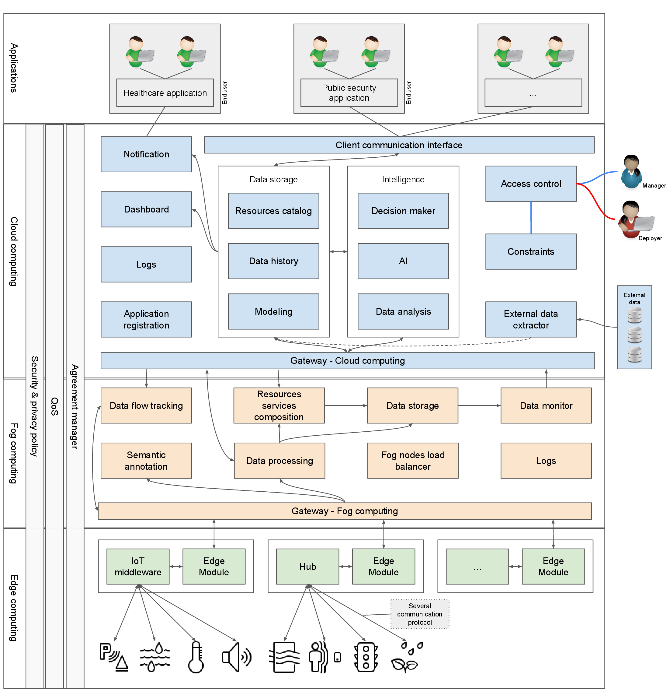

# UFCity

  

    
UFCity Platform

    <h1>Building smart cities, smartly</h1>
    

      UFCity offers a software ecosystem to interconnect city resources with AI-enabled services, spanning edge, fog, and cloud layers.
    

    

      <a class="btn primary" href="#architecture">Architecture</a>
      <a class="btn" href="#components">Platform components</a>
      <a class="btn" href="#scenarios">Usage scenarios</a>
      <a class="btn" href="#publications">Publications</a>
    

  

  

    

      
    

    
Modern architecture overview (PNG). Use the download link below for the full PDF.

    

      <a href="./assets/img/ufcity-architecture.pdf" download>Download architecture PDF</a>
    

  

  

    <h3>Edge</h3>
    
Low-latency processing close to citizens, devices, and sensors.

  

  

    <h3>Fog</h3>
    
Context enrichment, event processing, and semantic services near the edge.

  

  

    <h3>Cloud</h3>
    
City-wide intelligence, elastic orchestration, and AI-enabled services.

  

  

    <h3>Service composition</h3>
    
Combining data flows to deliver new, higher-value city services.

  

<h2 id="architecture">Architecture</h2>

The UFCity platform comprises a computer network architecture with three layers: edge, fog, and cloud computing. Each layer has software elements dedicated to data processing, storage, and analysis.

  <a href="tools-table.md">Tools and versions used in this prototype</a>

Some features of this platform are:
<ul class="feature-list">
  <li>Processing at each layer (de-overloading network nodes).</li>
  <li>Distributed storage.</li>
  <li>Data analysis according to semantics and context.</li>
  <li>Scalability and elasticity of services.</li>
  <li>Open source.</li>
  <li>Management of city resources: monitoring and activation.</li>
  <li>Support for Artificial Intelligence (AI), including machine learning (ML) analysis and intelligent decision-making.</li>
  <li>Data flow analysis.</li>
  <li>Instant actions based on patterns in data flow.</li>
  <li>Expansion and adaptation of AI-based on-demand functionalities.</li>
  <li>Combination of data flow to compose new services.</li>
  <li>Complex event processing.</li>
  <li>Data stratification for precise management.</li>
  <li>Sharing city data and resources between subdomains (multi-domains).</li>
  <li>Easy integration with other tools and systems.</li>
  <li>Many other features.</li>
</ul>

<h2 id="components">UFCity platform components</h2>

All components must be implemented in the city. Edge computing components deal with data closest to users, having knowledge restricted to the local context and offering services that help process and respond to the user.

Fog computing has a slightly broader knowledge than edge computing nodes. In this case, more complex services are available, such as semantic data annotation, complex event processing, and data flow combination.
Cloud computing has holistic knowledge of the city, allowing it to offer strategic and intelligent services. The insertion and adaptation of services in cloud computing are facilitated by the enabling technologies adopted and by the design strategy based on expansion via AI.

To learn more about these layers and initialize them in your project, see them in their respective repositories below.

### Edge computing

The [Edge Module](https://makleyston-ufc.github.io/ufcity-edge-module/) is a lightweight component developed in C++ and efficient for processing, grouping, filtering, and summarizing data, in addition to introducing contextual elements of space. Because it is developed in C++, it can be run on different devices, such as smartphones and Raspberry Pi.

### Fog computing

Fog computing was designed from the perspective of containerized services. Therefore, we adopted Docker to manage these containers.
In this layer, there are several software components, including those developed within this project: [UFCity-Handler](https://makleyston-ufc.github.io/ufcity-fog-handler/), [UFCity-CEP](https://makleyston-ufc.github.io/ufcity-fog-cep/) and [UFCity-Semantic](https://makleyston-ufc.github.io/ufcity-fog-semantic/).

To deploy all components easily, use the following [docker compose](https://makleyston-ufc.github.io/ufcity-fog-computing/).

### Cloud computing

Cloud computing has extensive knowledge of the city, making it possible to manage resource services across the entire city.
This layer was developed using the [OpenStack](https://www.openstack.org/) infrastructure for clouds.

AI-based intelligent processing and decision-making elements play an important role at this layer. To this end, UFCity adopts the [Zun](https://docs.openstack.org/zun/latest/) tool for managing microservices containers equipped with AI resources. Other tools manage load distribution and elasticity, allowing processing and storage suitable for any city model.

A cloud boot file via OpenStack can be found [here](https://makleyston-ufc.github.io/ufcity-cloud-computing/openstack/).

<h2 id="scenarios">Usage scenarios</h2>

We developed AI-equipped microservices to test a UFCity-based prototype and expanded the scenarios to include service composition workflows.

  

    <h3>AI models samples</h3>
    
Reference AI workloads deployed on the cloud layer.

    

      <a href="https://makleyston-ufc.github.io/ufcity-cloud-computing/samples/ufcity-ai-models-samples/">View samples</a>
    

  

  

    <h3>AI-equipped microservices</h3>
    
Microservices with AI resources and deployment recipes.

    

      <a href="https://github.com/makleyston-ufc/ufcity-cloud-computing/tree/main/samples/ufcity-microservices-samples">View samples</a>
    

  

  

    <h3>Service composition scenarios</h3>
    
Composição de serviços baseada em fluxo de dados para gerar serviços de maior valor.

    

      <a href="https://github.com/makleyston-ufc/service-composition">Explore scenarios</a>
    

  

<h2 id="publications">Publications</h2>

  

    [1] PEREIRA, Danne Makleyston Gomes; BRAYNER, Angelo. UFCity: A software architecture to create data ecosystem in smart cities. In: SYMPOSIUM ON INTERNET OF THINGS (SIoT), 2023, Sao Paulo. Proceedings... IEEE, 2023. p. 1-5. DOI: 10.1109/SIoT60039.2023.10389861.
     
    <a class="bibtex" href="./assets/bib/ufcity-siot-2023.bib" download>Download BibTeX</a>
  

  

    [2] PEREIRA, Danne Makleyston Gomes; BRAYNER, Angelo Roncalli Alencar. An integrated edge, fog, and cloud computing reference architecture for developing data ecosystems in smart cities. In: IEEE INTERNATIONAL CONFERENCE ON CLOUD NETWORKING (CloudNet), 13., 2024, Rio de Janeiro. Proceedings... IEEE, 2024. p. 1-9. DOI: 10.1109/CLOUDNET62863.2024.10815810.
     
    <a class="bibtex" href="./assets/bib/ufcity-cloudnet-2024.bib" download>Download BibTeX</a>
  

  

    [3] PEREIRA, Danne Makleyston Gomes. A microservices-based software architecture for building flexible smart city platforms. 2025. 176 f. Tese (Doutorado em Ciencia da Computacao) - Universidade Federal do Ceara, Fortaleza, 2025. Available at: https://repositorio.ufc.br/handle/riufc/84292.
     
    <a class="bibtex" href="./assets/bib/ufcity-ufc-thesis-2025.bib" download>Download BibTeX</a>
  

## Contact

  
<strong>danne.pereira@alu.ufc.br</strong>

  
<strong>makleyston@gmail.com</strong>

  
<strong>danne.pereira@ifce.edu.br</strong>

